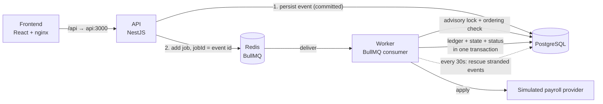
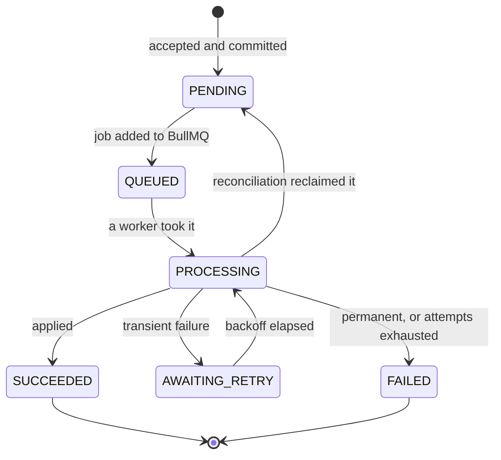

# Payroll Event Processing Service

A backend service that accepts employee payroll events over HTTP and processes
them asynchronously — reliably, exactly once, and in order per employee — even
when the external payroll system is slow or unavailable, when clients retry the
same request, and when workers crash or run in parallel.

**Stack:** Node.js · TypeScript · NestJS · PostgreSQL (TypeORM) · Redis · BullMQ
· Docker · React

---

## Quick start

```bash
git clone https://github.com/Mh-Monzil/payroll-event-processing-service.git
cd payroll-event-processing-service
docker compose up --build
```

That starts Postgres and Redis, applies migrations, seeds reference employees,
then boots the API, a worker, and the frontend.

| What                                | Where                        |
| ----------------------------------- | ---------------------------- |
| Frontend                            | http://localhost:5173        |
| API                                 | http://localhost:3000        |
| Swagger / OpenAPI                   | http://localhost:3000/api    |
| Liveness                            | `GET /health`                |
| Readiness (checks Postgres + Redis) | `GET /health/ready`          |
| Postgres                            | `localhost:5433`             |
| Redis                               | `localhost:6379`             |

> Postgres is published on **5433**, not 5432. Developer machines very often
> already run a native Postgres on 5432, and that collision is silent: tools
> connect to the wrong database and fail with a confusing auth error. Inside the
> compose network everything still uses `postgres:5432`.

### Try it

Submit an event, then watch it move through the UI, or from the command line:

```bash
curl -i -X POST http://localhost:3000/events \
  -H 'Content-Type: application/json' \
  -H 'Idempotency-Key: demo-1' \
  -d '{
    "type": "SALARY_CHANGE",
    "employeeId": "EMP-001",
    "effectiveDate": "2026-09-01",
    "payload": { "newSalary": 75000, "currency": "EUR" }
  }'

# 202 Accepted the first time, 200 OK and the same event id on any repeat.
curl http://localhost:3000/events/<id>
```

The seeded employees make the failure paths demonstrable:

| Employee            | What happens                                     |
| ------------------- | ------------------------------------------------ |
| `EMP-001`–`EMP-004` | Active — events process normally                 |
| `EMP-005`           | Inactive — fails permanently, `EMPLOYEE_INACTIVE` |
| `EMP-999`           | Unknown — fails permanently, `EMPLOYEE_NOT_FOUND` |

`PROVIDER_FAILURE_RATE` defaults to `0.3`, so roughly one attempt in three fails
transiently and you can watch retries happen without arranging anything.

---

## Architecture



Three processes, one codebase:

- **API** (`src/main.ts`) — validates, persists, enqueues, answers queries. It
  never processes anything, so a slow provider cannot slow down a request.
- **Worker** (`src/worker.main.ts`) — consumes jobs. It has **no HTTP port at
  all** in `docker-compose.yml`, which is the assignment's "background
  processing must not depend on keeping an HTTP request alive" enforced by the
  topology rather than by convention.
- **Frontend** — a static bundle behind nginx, which also proxies `/api` to the
  API so the browser only ever talks to one origin. No CORS, and no API host
  baked into the bundle.

Scale the worker to see the concurrency guarantees hold:

```bash
docker compose up --scale worker=3
```

---

## Event lifecycle



`SUCCEEDED` and `FAILED` are terminal. `FAILED` carries a second dimension,
`failureKind`:

- **`PERMANENT`** — a business rule was violated. Retrying can never help, so it
  is not retried even once more.
- **`RETRIES_EXHAUSTED`** — transient errors that never cleared within the
  attempt budget.

Waiting for a turn in the ordering queue is deliberately **not** a state: the
job is rescheduled with BullMQ's `moveToDelayed`, which does not consume one of
the event's attempts.

Every transition is appended to `event_status_history` in the same transaction
that changes the status column, so "what is it now" and "how did it get here"
can never disagree.

---

## Database design

| Table                     | What it is                                                        |
| ------------------------- | ----------------------------------------------------------------- |
| `payroll_events`          | The request log: what was submitted and where processing has got to |
| `event_status_history`    | Append-only audit trail, one row per transition                    |
| `payroll_applications`    | **The exactly-once ledger** — a row means the change was applied   |
| `employee_payroll_states` | The current payroll state of an employee                          |
| `employees`               | Seeded reference data                                             |

### Decisions worth explaining

**The ledger is a separate table, not a `status = SUCCEEDED` check.** Its
primary key is `eventId`. The apply transaction inserts there first with
`ON CONFLICT DO NOTHING RETURNING`, so a replayed job inserts nothing, skips the
mutation, and still settles the event. `status` is our workflow state; this is a
business fact. They are written in the same transaction so they cannot disagree.

**`sequence` (bigint) orders events, not `createdAt`.** Two rows can share a
timestamp and clocks on multiple API replicas drift. A sequence has one
authority and is strictly monotonic. Note that node-postgres returns `bigint` as
a **string**, so the ordering gate compares it in SQL — in JavaScript, `"10"`
sorts before `"9"`.

**`payload` is `jsonb`, `employee_payroll_states` is strongly typed.** The event
log has to accept whatever shape a future event type brings. The business state
is what gets queried and constrained, so it does not.

**`type` is `varchar` with a TypeScript enum, not a Postgres enum.** A Postgres
enum would mean an `ALTER TYPE` migration for every new event type. `status` and
`failureKind` *are* Postgres enums, because they are closed sets that we own and
that rarely change.

**Money is `numeric(14,2)` and round-trips as a string.** It never passes
through a JavaScript float.

---

## How the hard parts are handled

### Duplicate requests

Every event carries an `idempotencyKey` under a UNIQUE index. The key is either
the client's `Idempotency-Key` header or a SHA-256 fingerprint of the business
content — so two identical submissions collapse into one event even from a
client that has never heard of idempotency keys. Key order inside the JSON does
not change the fingerprint. Client keys and fingerprints are namespaced
(`client:` / `content:`) so a caller cannot forge one that collides with the
other.

The service looks the key up first, but that lookup is only a shortcut: two
concurrent retries both pass it. **The unique index is the actual arbiter** — the
losing insert raises `23505`, which is read as "duplicate" and answered with the
event that already exists (`200` instead of `202`).

### Multiple workers

Before doing anything, a worker takes a **Postgres advisory lock on the
employee**. Two workers can never be inside the same employee's events at once,
while different employees still run in parallel.

It is session-scoped rather than transaction-scoped because the lock has to span
the provider call as well as the database writes, and those are not one
transaction. It uses `pg_try_advisory_lock`, not the blocking variant: a worker
that waits is a worker that is not processing anybody else's events, so it
reschedules the job instead.

### Worker crash and recovery

Two independent nets:

1. **BullMQ stalled-job detection** re-delivers a job whose worker died holding
   it.
2. **A reconciliation sweep every 30 seconds** finds events the queue can no
   longer help with:
   - `PROCESSING` with no progress past `STUCK_EVENT_TIMEOUT_MS` — the worker
     died
   - `PENDING` older than that — the enqueue never reached Redis
   - `AWAITING_RETRY` whose retry time passed long ago — Redis lost the delayed
     job

   For each, it asks the ledger first. If the change is already applied, the
   event is simply settled. Otherwise it goes back to `PENDING` and is
   re-queued. The sweep never applies a payroll change itself.

   It claims rows with `FOR UPDATE SKIP LOCKED` rather than a global lock, so
   several workers can sweep at once and simply take different rows.

### Processing consistency

The scenario from the brief — provider succeeded, database written, worker
crashed before finishing, job replayed — is answered by the ledger. On every
attempt the worker checks `payroll_applications` **before** doing any work. A row
there means the change already happened, so the event is settled without calling
the provider again.

If two workers somehow reach the apply at once, the `ON CONFLICT DO NOTHING`
insert decides: the loser skips the mutation and still settles the event.

### Ordering

Holding the employee lock is not enough, because an earlier event may not be
running anywhere right now — it could be sitting in `AWAITING_RETRY`. So the
worker also asks: is there an event for this employee with a lower `sequence`
that has not settled? If yes, the job is rescheduled.

A terminal predecessor never blocks anything; waiting for a permanently failed
event would mean waiting forever.

### Temporary vs permanent failure

`classifyFailure` turns a thrown error into two things: what to tell the
engineer, and whether another attempt is worth it.

- `PermanentPayrollError` → never retried, `UnrecoverableError` tells BullMQ to
  stop
- `TransientProviderError` → retried with exponential backoff until the attempt
  budget runs out
- **Anything unrecognised is treated as transient.** Guessing wrong in that
  direction costs a few attempts; guessing wrong in the other direction loses a
  payroll change.

Failed events record `lastErrorCode`, `lastErrorMessage`, `lastErrorDetail` and
the full transition history, so an engineer investigating one can see every
attempt and why each failed.

### Extensibility

Adding `BONUS_PAYMENT` is: one enum member, one payload DTO, one registry entry,
one handler. No migration, and no change to the controller, worker, queue,
retry, idempotency or ordering logic.

Both registries are typed as `Record<PayrollEventType, …>`, so adding an event
type without a payload DTO or without a handler **fails to compile** rather than
failing at runtime. Handlers are pure — payload and current state in, a state
patch out — so a new event type never has to get transactions or the ledger
right again.

`GET /event-types` publishes the registry, and the frontend builds its form from
it, so a new event type reaches the UI without a frontend change.

---

## Local development without Docker

```bash
npm install
cp .env.example .env

npm run infra:up          # Postgres + Redis in Docker, nothing else
npm run migration:run
npm run seed

npm run start:api         # http://localhost:3000
npm run start:worker      # separate terminal
npm run dev:frontend      # http://localhost:5173
```

Requires Node 20+ (the images use Node 22).

### Migrations

```bash
npm run migration:run                    # apply
npm run migration:revert                 # roll the last one back
npm run migration:show                   # what is applied

# after changing an entity:
npm run migration:generate -w backend -- src/database/migrations/YourChange
```

Under Docker, migrations are applied by a one-shot `migrate` service that exits
before the API and worker start. That is deliberately not `migrationsRun` on
boot: with several replicas, every replica would race to alter the same schema.

---

## Environment variables

| Variable                 | Default       | What it does                                             |
| ------------------------ | ------------- | -------------------------------------------------------- |
| `NODE_ENV`               | `development` |                                                          |
| `PORT`                   | `3000`        | API port                                                 |
| `DATABASE_URL`           | **required**  | Postgres connection string                               |
| `DATABASE_LOGGING`       | `false`       | Log every SQL statement                                  |
| `REDIS_HOST`             | `localhost`   |                                                          |
| `REDIS_PORT`             | `6379`        |                                                          |
| `PROVIDER_FAILURE_RATE`  | `0.3`         | Chance the simulated provider fails transiently          |
| `PROVIDER_LATENCY_MS`    | `1500`        | Simulated round-trip to the provider                     |
| `JOB_ATTEMPTS`           | `5`           | Attempts per job, including the first                    |
| `JOB_BACKOFF_MS`         | `1000`        | Base delay for exponential backoff                       |
| `WORKER_CONCURRENCY`     | `5`           | Jobs one worker runs at once                             |
| `ORDERING_DEFER_MS`      | `500`         | How long a job waits before re-checking its turn         |
| `STUCK_EVENT_TIMEOUT_MS` | `120000`      | How long without progress before reconciliation steps in |

The environment is validated at boot; a missing or malformed value stops the
process with a readable message rather than failing later.

---

## Testing

```bash
npm run test:unit         # no database, no Redis, no setup
npm run test:integration  # needs Postgres with migrations applied
npm test                  # both, so it needs Postgres too
```

**Unit tests** cover the decisions: idempotency key derivation, failure
classification, per-type handlers, the registries, and the processor's whole
decision tree — replay after a crash, two workers racing for the ledger,
permanent vs transient failure, the last attempt, and deferral for ordering.
Repositories, the queue and the provider are mocked, because the subject is the
logic, not the storage.

**Integration tests** cover what mocks cannot stand in for: the reconciliation
sweep runs against a real Postgres, because its subject *is* the SQL — the
staleness predicate, `FOR UPDATE SKIP LOCKED`, and transactional writes. The
most valuable test there is that an event still inside its timeout is left
alone; written with a mocked repository, that test would only be checking the
mock.

They are split into separate jobs in CI so a database is only started for the
tests that need one.

---

## CI

`.github/workflows/ci.yml` runs on every pull request into `main`, and `main` is
protected so nothing merges without it passing.

| Job           | What it checks                                                        |
| ------------- | --------------------------------------------------------------------- |
| `quality`     | ESLint, Prettier and `tsc --noEmit` across both workspaces            |
| `unit`        | The unit suite                                                        |
| `migration`   | Migrations apply to an empty database, and entities have not drifted  |
| `integration` | The integration suite against a real Postgres                         |
| `build`       | Both Docker images build                                              |

Two rules worth calling out. No job uses `continue-on-error`: this pipeline is a
merge gate, not an informational report. And the `migration` job matches on
TypeORM's output message rather than its exit code, because `typeorm` exits `1`
both when there is nothing to generate and when it cannot connect — trusting the
exit code would turn a connection failure into a green check.

---

## API

Swagger UI is at http://localhost:3000/api, and the OpenAPI document at
`/api-json`.

| Endpoint           | Purpose                                          |
| ------------------ | ------------------------------------------------ |
| `POST /events`     | Submit an event. `202` new, `200` duplicate      |
| `GET /events`      | List, filterable by employee, status and type    |
| `GET /events/:id`  | One event with its full transition history       |
| `GET /event-types` | What this service accepts, and the fields needed |
| `GET /health`      | Liveness                                         |
| `GET /health/ready`| Readiness — Postgres and Redis reachable         |

Requests carry a type-agnostic envelope with the type-specific fields in
`payload`:

```json
{
  "type": "ADDRESS_CHANGE",
  "employeeId": "EMP-001",
  "effectiveDate": "2026-09-01",
  "payload": {
    "street": "Hauptstrasse 12",
    "city": "Berlin",
    "postalCode": "10115",
    "country": "DE"
  }
}
```

The brief showed these fields flat. The envelope was chosen because it maps
one-to-one onto storage — three columns plus a `jsonb` payload — and because
adding an event type then never touches the envelope. Common fields are
validated once; `payload` is validated against whatever DTO the registry holds
for that `type`, and anything the DTO does not declare is rejected rather than
quietly stored.

Errors are specific enough to act on:

```json
{
  "success": false,
  "message": "Invalid payload for event type SALARY_CHANGE",
  "error": {
    "code": "INVALID_EVENT_PAYLOAD",
    "eventType": "SALARY_CHANGE",
    "fields": [
      { "field": "currency", "messages": ["currency must be a valid ISO4217 currency code"] }
    ]
  }
}
```

---

## Trade-offs

**Polling, not websockets.** The frontend polls every 1.5s and stops for
terminal events. Live updates would be nicer; they are not what this assignment
is about.

**One queue, ordering enforced at the worker.** A queue per employee would give
ordering for free but needs unbounded queues. Checking a predecessor costs one
indexed query per attempt and keeps the topology to a single queue.

**Advisory locks, not a lock table.** They cost nothing to clean up: Postgres
releases them when the session ends, so a killed worker cannot leave one behind.
The trade-off is that `hashtext` can collide, in which case two unrelated
employees serialise briefly — correct, just slightly slower.

**Field descriptors are declared, not derived.** `GET /event-types` describes
each payload for clients, and the DTO remains the only thing that validates. A
unit test reads class-validator's metadata and fails if the two ever disagree.

**No e2e suite.** The unit and integration layers already cover every scenario
the brief lists. A supertest layer on top would mostly re-test what the
integration tests prove against the same database.

### If this were going further

Structured JSON logs with a correlation id per event; metrics on queue depth,
attempt counts and time-to-settle; a dead-letter view for permanently failed
events; and cursor pagination on `GET /events` once the table is large enough to
care.
