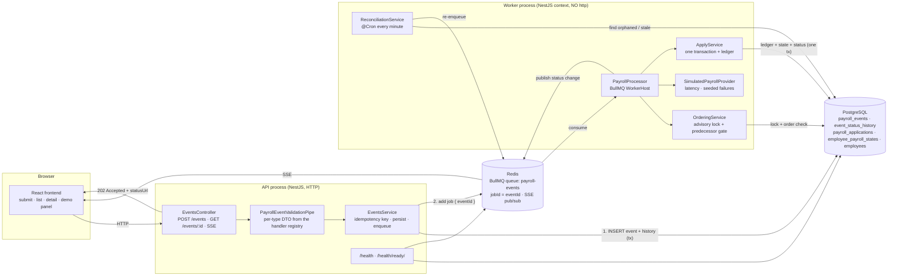
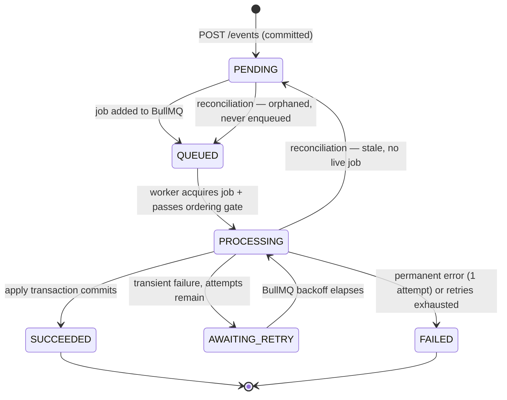

# Architecture

## Component & data flow



## ASCII version (for terminals / plain README fallback)

```
   ┌──────────────┐
   │   Browser    │  React: submit · list · detail · demo panel
   └──────┬───────┘
          │ HTTP + SSE
          ▼
   ┌─────────────────────────────────────────┐
   │  API process (NestJS)                   │
   │   validate (per-type DTO via registry)  │
   │   derive idempotency key                │      202 Accepted
   │   INSERT event + history   ── tx ──►    │──────────────────►
   │   queue.add({eventId}, jobId=eventId)   │
   └───────┬────────────────────────┬────────┘
           │                        │
   ┌───────▼────────┐      ┌────────▼────────┐
   │  PostgreSQL    │      │     Redis       │
   │  source of     │      │  BullMQ queue   │
   │  truth         │      │  (ids only)     │
   └───────▲────────┘      └────────┬────────┘
           │                        │ consume
           │               ┌────────▼─────────────────────────┐
           │               │  Worker process (no HTTP)        │
           │               │   1. ordering gate               │
           ├───────────────┤      advisory lock(employeeId)   │
           │  lock + read  │      + predecessor check         │
           │               │   2. handler.validate()          │
           │               │   3. simulated provider call     │
           │  one tx:      │   4. APPLY (single transaction): │
           ├───────────────┤      ledger INSERT ON CONFLICT   │
           │  ledger +     │      + state upsert              │
           │  state +      │      + status SUCCEEDED          │
           │  status       │                                  │
           │               │   ReconciliationService @Cron    │
           └───────────────┤      stale PROCESSING            │
                           │      orphaned PENDING            │
                           └──────────────────────────────────┘

   Scale: docker compose up --scale worker=3
   Correctness across workers = advisory lock (per employee) + ledger unique key
```

## Event state machine



`SUCCEEDED` and `FAILED` are terminal. `FAILED` carries `failureKind`:
`PERMANENT` (retrying can never help) or `RETRIES_EXHAUSTED` (transient errors
that never cleared).

## Where each reliability guarantee lives

| Guarantee | Mechanism | Location |
|---|---|---|
| Request never blocks on processing | 202 + queue | `events.service.ts` |
| Duplicate HTTP request | `UNIQUE(idempotencyKey)` | Postgres constraint |
| Duplicate job | `jobId = eventId` | BullMQ |
| Duplicate application | `UNIQUE(eventId)` on the ledger, inside the apply tx | Postgres constraint |
| Two workers, one employee | `pg_advisory_xact_lock(hashtext(employeeId))` | Postgres |
| Per-employee FIFO | `sequence BIGSERIAL` + predecessor gate + `moveToDelayed` | Postgres + BullMQ |
| Transient vs permanent | typed error hierarchy + `UnrecoverableError` | `failure-classifier.ts` |
| Worker crash | BullMQ stalled detection **and** reconciliation cron | Redis + Postgres |
| Crash after DB write | ledger insert is the first statement of the apply tx | Postgres |
| Audit trail | `event_status_history` (append-only) + `payroll_applications.snapshotBefore` | Postgres |
